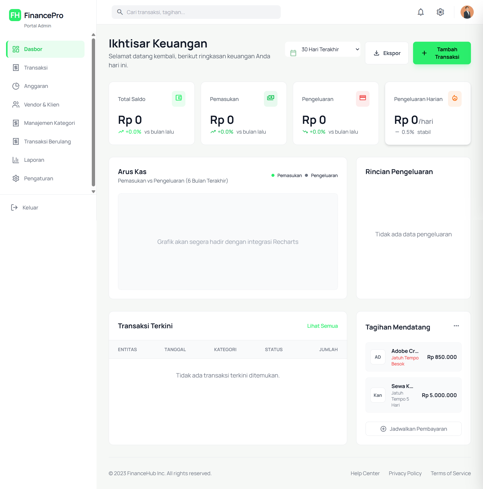
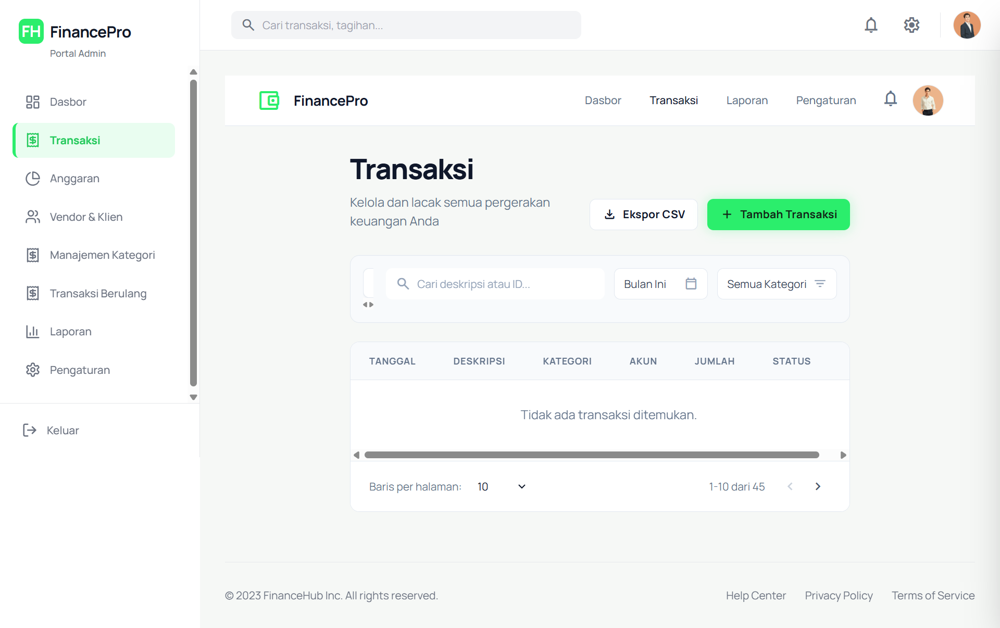

# 💰 FinancePro - Personal Finance Dashboard


**FinancePro** is a comprehensive, full-stack personal finance management application designed to help users track their income, expenses, and budgets with precision. Built with modern web technologies, it features real-time data visualization, secure authentication, and a robust relational database architecture.

> **Note to Recruiters:** This project serves as a demonstration of full-stack development capabilities, including database design, API development, and frontend state management.

---

## 🚀 Key Features

*   **📊 Interactive Dashboard:** Visual overview of financial health using Chart.js.
*   **🔐 Secure Authentication:** JWT-based auth with bcrypt password hashing.
*   **💸 Transaction Management:** Record income and expenses with detailed categorization.
*   **📑 Category Management:** Hierarchical category system (Parent > Child) for granular tracking.
*   **📅 Budgeting:** Set monthly or quarterly budgets and track progress.
*   **🐳 Dockerized:** Fully containerized setup for easy deployment and consistency.

## 🛠 Tech Stack

*   **Frontend:** React, Vite, Tailwind CSS, Chart.js, Lucide Icons
*   **Backend:** Node.js, Express, Prisma ORM
*   **Database:** PostgreSQL 15
*   **DevOps:** Docker, Docker Compose

## 🏁 Getting Started

The easiest way to run this application is using Docker Compose.

### Prerequisites

*   Docker and Docker Compose installed on your machine.

### Installation

1.  **Clone the repository**
    ```bash
    git clone https://github.com/yourusername/finance-dashboard.git
    cd finance-dashboard
    ```

2.  **Run with Docker Compose**
    ```bash
    docker-compose up -d --build
    ```

3.  **Access the Application**
    *   **Frontend:** `http://localhost:8080`
    *   **API:** `http://localhost:3002`

## 📸 Screenshots

| Dashboard | Transactions |
|:---:|:---:|
|  |  |

> **Note:** See `docs/images/` for full resolution screenshots.

## 🚀 Deployment

We have a detailed [Deployment Guide](docs/DEPLOYMENT.md) supporting:
*   **Backend & DB:** Render.com (Free Tier)
*   **Frontend:** Vercel (Free Tier)

### Quick Links
*   [Deploy Backend](https://render.com)
*   [Deploy Frontend](https://vercel.com)


## 🧪 Testing

The project includes unit and integration tests.

```bash
# Run backend tests
cd apps/api
npm test
```

## 📄 License

This project is licensed under the MIT License - see the LICENSE file for details.
